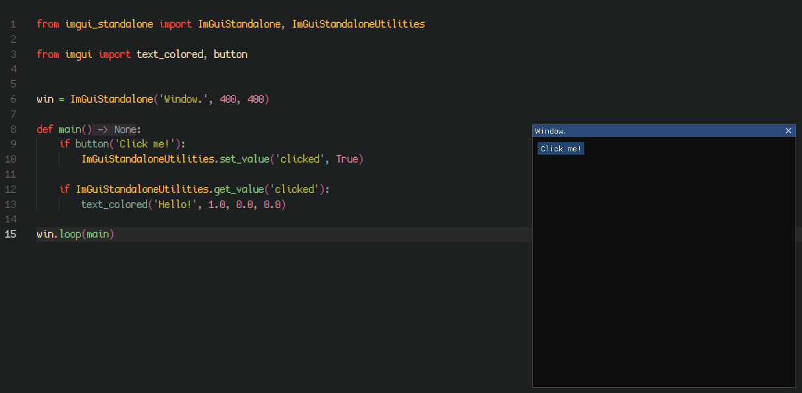

<h1 align="center">imgui_standalone 1.1.0 ALPHA</h1>
<h3 align="center">🧩 Standalone ImGui window. ⚓</h3>

<p align="center"></p>

```python
from imgui_standalone import ImGuiStandalone, ImGuiStandaloneUtilities

from imgui import text_colored, button


win = ImGuiStandalone('Window.', 400, 400)

def main() -> None:
    if button('Click me!'):
        ImGuiStandaloneUtilities.set_value('clicked', True)

    if ImGuiStandaloneUtilities.get_value('clicked'):
        text_colored('Hello!', 1.0, 0.0, 0.0)

win.loop(main)    
```

- Simple, easy-to-use, optimized solution.
- Uses safe rendering framework.
- Flexible (`ALWAYS_ON_TOP`, Builtin Show/Hide window keybinds, custom ImGui window flags, etc).
- Basic window functions (moving, closing, etc).
- Builtin events handling.
- Builtin utilities.<br><br>

Installation: Download `imgui_standalone` and move into your project and use it!<br>
Documentation: Coming later, look into source code or follow your editor type hints.<br>

<hr><p align="center"><b>imgui_standalone 1.1.0 ALPHA</b></p>
